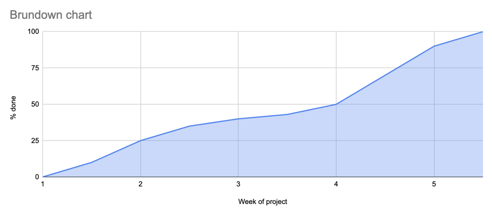

# Project Report, Qoders 

# 1.1 Participant list
| NAME | EMAIL |
|----------|------------|
| Hector Bergman|hector.bergman.4575@student.uu.se
| Martin Cavallin| martin.cavallin.6468@student.uu.se|
| Simon Gebre Yohannes| simongebreyohannes99@gmail.com
| Alexander Liberman|  4lex030@gmail.com
| Josias Roeland| Josias.roeland@gmail.com|
| The final member dropped out| 

# 2 Quantification 
**Project start date:** 11/12/23
**Project end date:**   12/01/23
**Number of sprints, their start and end dates:**
| SPRINT | START | END |
|----------|------------|---|
|Sprint 1 "Delegation and getting started"| 11/12/23| 18/12/23|
|Sprint 2 "Deepwork on essential functions"| 18/12/23| 29/12/23|
| Sprint 3 "Implementation and finalization"| 29/12/23| 12/1/23|

**Total number of new lines of C code written excluding tests and preexisting code:** 245
**Total number of lines of test code:** 246
**Total number of lines of “script code” (e.g., make files, Python scripts for generating test data, etc.):** 78
**Total number of hours worked by the team:** 231 hours
**Total number of git commits:** 168 commits
**Total number of pull requests:** 13 pull requests
**Total number of GitHub issues:** 7 issues

# 3 Process   
## 3.1 Inception

We chose to pick a process very similar to the one lined out in the "Process Requirements" section of the course project module. We used Trello to keep track of tasks and delegation of said tasks, GitHub for version control, issue tracking, and pull requests. We used makefile containing tools like 'valgrind' to control memory leaks and to automate testing and building. We began by dividing all parts of the project into smaller tickets, when these tickets were decided we added all of them and any other smaller tasks to Trello. This then allowed us to delegate these tickets out amongst the group which quickly meant we could begin working on our separate parts of the project parallel to each other and also keeping track of how far along we were in the process of completion.

## 3.2 Implementation
We believe we implemented our process thoroughly and succeeded in the initial idea of how we wanted the work process to unfold. The strengths of our process were that we were acutely aware of things that had to be done and who did what. The process of Trello and Github ensured that no individual in the group lacked information regarding the project, this was because everything was managed through tools everyone had access to. Weaknesses however presented themselves when we realized some parts were much harder than others, one ticket could be finished in hours while others took days, this created a discrepency in time management and, initially, we had no contingency plan for this scenario which proved to be a problem. 

If we were to redo the project tomorrow we would apply the same process but with more contingency plans, we would consider the possibility of worst-case scenarios and reflect on how we would solve an issue that could potentially arise. We would repeat the method of using previously stated tools as well as using a Tech lead in charge of version control and pull requests as we consider this to have been a success. We would continue using the system of tickets and an early delegation of tasks as this proved successful. It was also a success to have plans that were adjustable and not completely rigid, it allowed us to work in a dynamic way which improved the possibility of receiving help from other group members; It allowed us to adapt our plan as we went along when we discovered our initial plan may have been unfounded or based off misinterpretation. 

# 4 Use of Tools

#### What tools you used in the project and how were they used?
For this project our main tools has been:
- **Visual Studio Code** for an easy programming experience.
- **Visual Studio Live Share** for easy collaboration when working and coding together.
-  **Github desktop** for an easy UI that helps us efficiently do pull, push, merge and other git commands while also navigating our different branches.
- **Trello** in order to organize our work load and keep track of whos doing what and how far along we are in the project.
- **Discord** as our main means of communication as it provides an intuitive UI and can be combined with built in bots that automatically provides us with up-to-date information from our Github repository. 
- **Valgrind** to test our code for memory leaks.
- **GDB** as our main debugging tool.
- **gcov** in order to give confidence in overall code coverage on different branches.
- **astyle** in order to format our entire code to a specific coding standard.

#### Were you missing any tools?
No.
#### What tools would you rather not use in the future?
We felt that the usage of the issue log during this project felt forced and unnatural, this may be because of us not yet being comfortable with using it or because we felt no real need for it.
# 5 Communication, Cooperation and Coordination   

Communication during this project has worked very well, we started by creating a discord server which was used as our main form of communication and where we've kept the mood light and friendly. Communication with people outside the team has not been organized other than our three meetings with our "Coach", the coach meetings were done simply by sending out an email and deciding on a good date. 

In regards to cooperation and coordination; we decided on our first group meeting that we would split the project into smaller tickets, some of these tickets would then be spread out amongst smaller groups of two within the project group. By doing this we could isolate problems to specific people and allow everyone to feel responsible for specific aspects of this project. Using Trello it also allowed us to send more people to places of the code where it was needed. We also assigned one member to be "_Tech lead_", he was responsible for accepting pull requests and was also the one managing the makefile and github in general. Giving this task to one specific person also ensured that we had both a chain of command and a structure which allowed for help to be given and received. 

During the break we all knew the tasks we had and so we singled out two days on which all communication, cooperation and coordination were to happen. This allowed us to work independently and yet confirm progress or stalling in a relevant way. 

One essential issue that caused great damage to the progress of the project was that it took us almost a fortnight to get into contact with the final member, only to realize that he was no longer part of the course. This meant the workload structure we initially decided upon now was no longer feasible and each member and the project as a whole suffered as a consequence. 

One lesson we will consider next time is that we realize that we worked independently for too long, so although we communicated efficiently we should have been more attentive in regards to understanding each others tasks and problems. Being too isolated on your own task and problem can create compatibility problems when it is not addressed to the group and an improvised solution is eventually delivered. 

# 6 Work Breakdown Structure

For this project we planned for three separate sprints which included different phases of the project: intro and delegation, deep dive into our tasks and finally implementation. The time plan was set based on our decided group meetings and at certain group meetings we were expected to be finished with our personal task for the sprint. 

We decided after the first group meeting that the best thing to do would be to give each person a ticket, we had no formal way of delegating this other than each person picking a ticket they found to be interesting. This way we knew our own personal task and could focus solely on it. We used pair programming on the tasks that seemed to be most difficult to complete and we used pair programming to write all reports, this also helped the ones tasked with more difficult code to focus on the code only and the "report writers" could function as helpers. Pair programming did not seem necessary for all tasks however. 

- These were the tasks we created out of this project. 

| Tasks | Description                                      |
|---------------|--------------------------------------------------|
| Ticket 1/Memory allocation | Implement functions for allocate() and allocate_array(), initialize reference counter for created object  |
| Ticket 2/Reference counting functions      | Implement retain() and release()|
| Ticket 3/Deallocate() and tests     | Write deallocate() and test cases    | 
| Ticket 4/Cascading frees      |  Create clean_up(), create set_cascade_limit()  |
| Ticket 5/ Memory overhead      | Create constant factor of memory overhead |
|Ticket 6/Implementation and integration| Implement the demo and finish integration of project 
| Project Reports       |  Code Quality Report, Code Review Report, Design Report, Project Report, Test Report                 |

We also used pair programming and made our best to divide the project into smaller tickets and subtasks using Trello. This allowed us to keep track of progress and ensuring that if someone was falling behind with others finishing early we could easily intervene and provide needed support. However because we could not properly assess the difficulty of some of the given tasks the workload was not proportionally distributed. This lead to the process of assessing just how much time and effort was needed becoming an unforseen issue which cascaded into thinking we were close to a solution while having a long way to go. 

It is difficult to assess the "size" of tasks that are different in nature compared to what one previously has dabbled with. Difference in skill and capability leads to a relevant difference in what is "equal". Because of this Trello was frequently used to track progress but mostly we relied on each other to give everyone a heads up if one was falling behind or quickly succeeding with given task. We also came to realize that whatever time we think we will need, realistically we found that it would take many times the amount. It could be a combination of lacking proper knowledge in creating a coding project and overestimation of skill but looking back we still believed it would be difficult but did not understand how difficult. 

_This chart shows how we ended up distributing our time during the course of the project._

_This chart shows how much work we got done during the course and the tempo we had_

#### Work Breakdown Insights
- Planning for the integration

We did not have proper understanding for how the implementation would practically be done as we saw it as "a future problem", we believed integration and the demo would be easier to solve and in doing that we ended up hitting a wall where our performance did not match the sprints expectation, this in turn created a bottle neck which stopped us from integrating because we simply did not have the proper code to do so. 

- Merging tickets and work 

We have also realized that we should have merged some tickets when they were starting to get finished, it would have been easier to start working together earlier in order to ensure that different pieces of code had compatibility. Because we had this approach we created code that worked independently and passed tests but once merged suddenly failed tests and stopped functioning. 

- Insight conclusion 

In a project consisting of different parts that all must be compatible, it can be beneficial to establish task distribution where certain tasks have earlier deadlines than others. If some tasks are essential to further progress of the project then they must be finished quicker than a task that is not as essential for things like integration. This way, one can detect problems earlier or if someone hasn't managed to complete a task that is of an essential nature. What happened during the execution of this project was that regular meetings and offers of help proving not to be sufficient. A task was not completed within the specified time, making it impossible to assemble all the parts satisfactorily in order to successfully complete the task on time

# 7 Reflection

We feel confident that what we delivered has been implemented in the correct way. This is because we have tests checking the delivered product which gives us confidence we have performed to the standard that was expected. We do however not possess the entire implementation as we have referenced earlier in this report. In essence we are confident in the quality of what we delivered but is missing the complete finished product. 

-**On a scale 1–7 (7 is best), rate your satisfaction with your process and provide justification for that number**
5, we feel that our process has worked well despite us feeling stressed in the last days before the presentation, struggling to finish the final aspects of the project. We believe the process itself has worked fine but we could improve on being more strict in following the process itself more religiously. 

-**On a scale 1–7 (7 is best), rate your satisfaction with your delivered product and provide justification for that number**
3, We are not pleased with the delivered product in terms of completion based on the given task. However, because of a lacking teammember, overlaps with assignments several team members had to finish, and other exams to focus on we believe what we did deliver was material that at least let us sleep at night. These factors and the high expectations we had of ourselves has resulted in us being somewhat disappointed with the outcome. 

-**On a scale 1–7 (7 is best), rate your satisfaction with your quality assurance and provide justification for that number**
5, our quality assurance worked by having someone that did not write the code(preferably the tech lead) examine the pull requests and then after review push it to the master branch, we believe this was a good system and allowed us to find each others errors efficiently. Other than using a tech lead and pull requests we also worked a lot with unit testing to ensure our quality. 

-**What does the team consider its biggest win?**
Collaboration was a big win for us as we managed to split the project into smaller tasks which were then delegated, spread across the group. This allowed us to efficiently have a good idea of what was supposed to be done and who was supposed to do what. 

-**What does the team consider its biggest fail?**
The biggest fail was that we underestimated the workload required to complete the integration and what would be needed for it. This was a result of not being strict enough on when and what should be finished.
